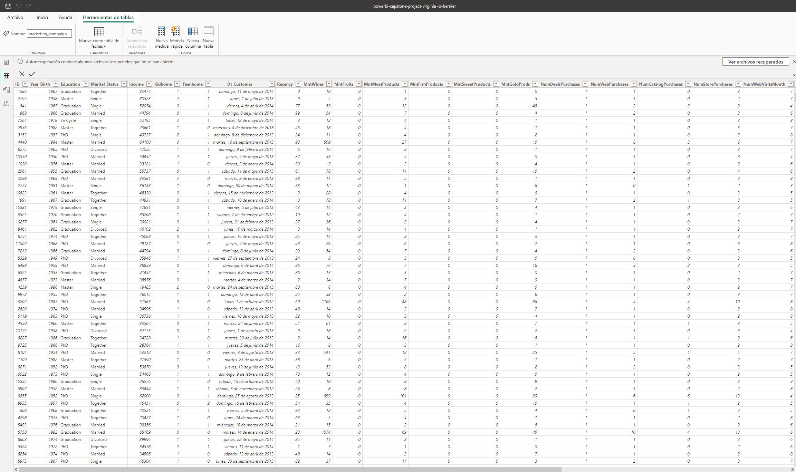
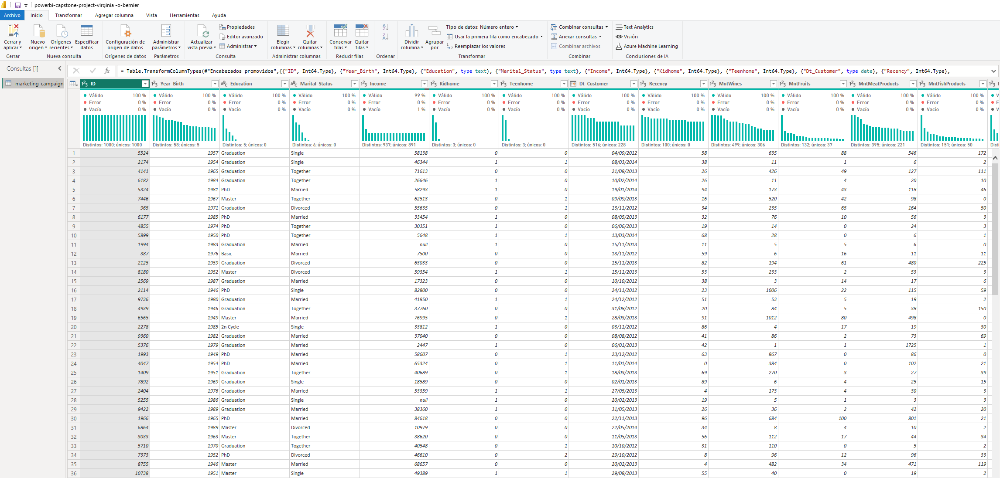

# Data Analytics Capstone Project

## Contenido
[1. Introducción](#1-introducción)
[2. Objetivo](#2-objetivo)
[3. Actividades](#3-actividades)
[4. Los datos: Overview Marketing Data](#4-los-datos-overview-marketing-data)

## 1. Introducción
El presente documento forma parte del proyecto final del curso Power BI - IBM SkillsBuild. En el se reflejan las pautas de dicho proyecto y se adjuntan imágenes que demuestran la realización de la actividad.

## 2. Objetivo
DH Marketing Consultants te ha contratado como analista de datos para explorar y analizar una serie de datos del departamento de marketing. El director de marketing necesita generar valor a través de estos datos y te pide hacer un análisis. El análisis debe basarse en los diferentes factores que podemos medir del dataset. 

La empresa requiere que como mínimo organices los datos por fechas, campañas, productos.

## 3. Actividades
• Limpieza de datos.
• Transformación de datos.
• Visualizaciones de datos.

## 4. Los datos: Overview Marketing Data
Los datos proporcionados corresponden a una fuente de datos abiertos, la cual nos proporciona data relacionada con 5 campañas de marketing que realizo una empresa, las plataformas que se utilizaron y la cantidad de veces que se hicieron ventas a través de estas plataformas entre otros datos muy interesantes a los cuales se les puede extraer una gran cantidad de información

## 5. Fuente del conjunto de datos
Link de la fuente de datos: [Datos](https://www.kaggle.com/datasets/rodsaldanha/arketing-campaign?resource=download)

## 6. Proyecto

### Actividad 1: carga de datos

- 1.1. Conecta los datos csv con power BI.
- 1.2. Revisa los datos en el transformador de datos de Power Query y analiza el contenido de las columnas.
- 1.3.  Analiza y modifica los tipos de datos de las columnas






### Actividad 2: Limpieza de datos
- Busca errores en los datos: valores atípicos, datos en blanco o errores de escritura, verifica por ejemplo que las fechas son coherentes y no hay clientes con más de cien años.

Análisis por columnas:

1. **Column ID**
- Tipo de dato: numérico (Entero).
- Representa: identificador único para cada cliente.
- Comentarios: ho hay duplicados.

2. **Column Year_Birth**
- Tipo de dato: numérico (Año).
- Representa: año de nacimiento del cliente.

3. **Column Education**
- Tipo de dato: categórico (Texto).
- Representa: nivel académico del cliente (5 tipos).

4. **Column Marital_Status**
- Tipo de dato: categórico (Texto).
- Representa: estado civil del cliente (6 tipos).

5. **Column Income**
- Tipo de dato: numérico (Continuo).
- Representa: ingreso económico anual del cliente.
- Comentarios: existen valores nulos y atípicos (outliers). 

6. **Column Kidhome**
- Tipo de dato: numérico (Entero).
- Representa: número de niños en el hogar.

7. **Column Teenhome**
- Tipo de dato: numérico (Entero).
- Representa: número de adolescentes en el hogar.

8. **Column Dt_Customer**
- Tipo de dato: fecha.
- Representa: fecha de alta del cliente.
- Comentarios: representa un periodo de casi dos años.

9. **Column Recency**
- Tipo de dato: numérico (Entero).
- Representa: días desde la última compra del cliente.
- Comentarios: posible agrupación en rangos de días para detectar clientes recientes vs. inactivos.

10. **Columns amounts**
Cantidad gastada en los útlimos dos años según el producto:
- MntWines: vino.
- MntFruits: fruta.
- MntMeatProducts: carne.
- MntFishProducts: pescado.
- MntSweetProducts: dulces.
- MntGoldProds: oro.

11. **Columns Purchases**
Columnas que muestran valores relacionados con tendencias de comprar e interacciones del cliente con la empresa.
- NumDealsPurchases - compras con descuento.
- NumCatalogPurchases - compras usando catálogo.
- NumStorePurchases - compra directa en tienda.
- NumWebPurchases - compras en la web.
- NumWebVisitsMonth - número de visitas a la web en el último mes.

12. **Columns Accepted**
Diferentes columnas en función de la campaña. Valores 0 y 1 según si el cliente aceptó l aoferta o no de dicha campaña.

### Actividad 3: Transformación de datos
- Renombra las columnas y organízalas de la mejor manera posible. Proporciona la razón por la que realizaste los cambios en estas columnas para el análisis de datos.
- Analiza y modifica los tipos de datos de las columnas.
- Lee el archivo csv de datos y conviértelo en un data set valido.
- Revisar los datos en el transformador de datos de Power Query y analizar el contenido de las columnas.
- Busca errores o valores atípicos en los datos.
- Edita las columnas en caso de ser necesario.

**3.1. Column Age**
A partir de los años de la columna *Year_Birth* se calcula la edad y se guarda en  una nueva columna  *Age*.

```DAX  
Date.Year(DateTime.LocalNow()) - [Year_Birth]
```

**3.2. Column Year_Birth**
Los valores se distribuyen entre 1976 y 1993, por lo que aparentemente parecen correctos. 

**3.3. Column Income**
Existen 13 valores nulos y la desviación estándar es de 21876,85. Puesto que la columna tiene un rango amplio, 
alta dispersión y posibles outliers, la mediana es probablemente la mejor opción para los valores nulos. Es menos sensible a los valores extremos y podría ser mejor representación.

**3.4. Columns Kidhome - ChildrenHome**
Estas columnas contiene 0 y 1 en función de si hay niños de esas edades o no en el hogar. 
Se ha considerado que la franja de edad en una campaña de markerting puede ser importante, 
por lo que se ha creado una nueva columna llamada Childrenhome con los siguientes valores:
- None: en caso de que el valor en ambas columnas sea 0 y por tanto no hay menores en el hogar.
- Todler: en caso de que 0 en Teenhome y 1 en Kidhome, ya que al menos existe menor pero no es adolescente.
- Teen: en caso de adolescente.
- Children: en caso de que el valor de ambas columnas sea 1. 

La consulta utilizada ha sido:
```DAX
if [Teenhome] = 0 and [Kidhome] = 0 then "None"
else if [Teenhome] = 0 and [Kidhome] = 1 then "Todler"
else if [Teenhome] = 1 and [Kidhome] = 0 then "Teen"
else "Children"
```
**3.5. Column MntTotalProducts**
Se ha creado una columna con el gasto total de producto por cliente, en los dos últimos años unificando las siguientes columnas: 

- MntWines: vino.
- MntFruits: fruta.
- MntMeatProducts: carne.
- MntFishProducts: pescado.
- MntSweetProducts: dulces.
- MntGoldProds: oro.

**3.6. TotalPurchases**
Total de compras por cliente. 

```DAX
TotalPurchases = [NumDealsPurchases] + [NumCatalogPurchases] + [NumStorePurchases] + [NumWebPurchases]
```
### Actividad 4: Modelado de datos
- 4.1. Cree un modelo de datos cuya estructura se base en una única tabla de hechos. La tabla de hechos debe estar en el centro del modelo conectada a las tablas de dimensiones en forma de estrella.

### Actividad 5: Visualizaciones
- 5.1. Crear las visualizaciones necesarias para la comprensión de los datos. El cuadro de mandos debe contener al menos 3 hojas, deben estar correctamente enlazadas para el correcto funcionamiento de filtros y botones.
Estructura mínima:
    1. Una hoja de la visión general de los datos.
    2. Una hoja de los datos analizando las campañas.
    3. Una hoja de los datos analizando los productos.
    4. Una hoja cero oculta donde haremos anotaciones.
- 5.2. Crea un modelo estrella con tus tablas.
- 5.3. Crea una descripción general de los datos
- 5.4. Crea visualizaciones de los datos de las 5 campañas.
- 5.5. Crea visualizaciones con los datos de estado civil, hijos, etc.
- 5.6. Crea visualizaciones de los datos de los tipos de productos
- 5.7. Crea visualizaciones de los datos de plataforma de compra